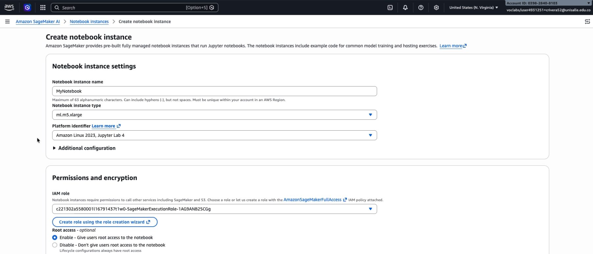
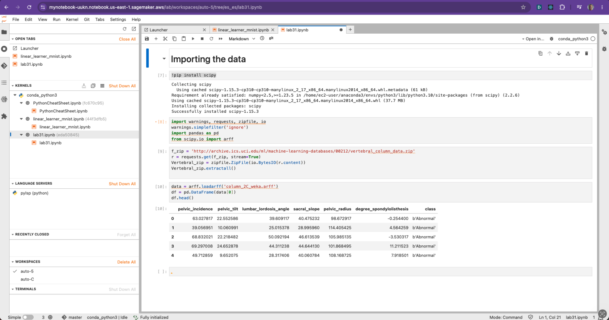
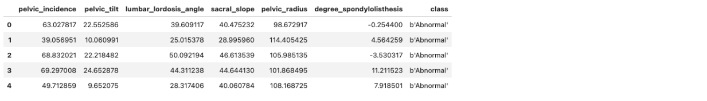
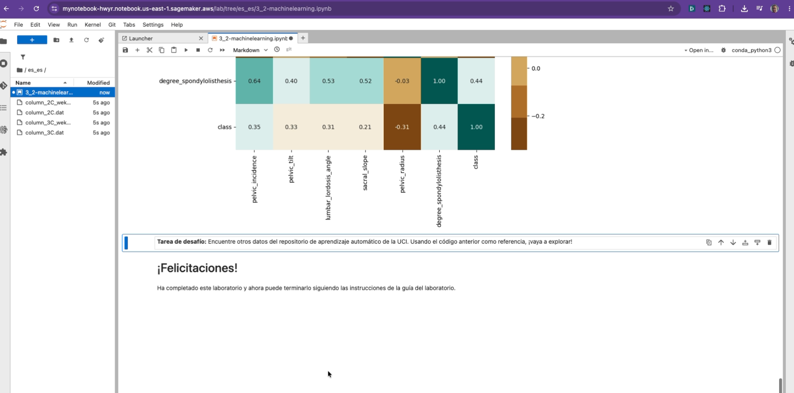

# Laboratorios en AWS academy

- **Actividad 4 – Laboratorio en AWS**
- **Estudiante:** Camilo Rivera Quintero
- **Docente:** Rodrigo Fernandez Aranda
- **Curso:** Teoría de la Computación 2 - Virtual

## Sobre esta actividad

Este repositorio reúne la evidencia de los tres laboratorios guiados de Amazon SageMaker que desarrollé para la Actividad 4.

- **Laboratorio 3.1** – Amazon SageMaker: creación e importación de datos.
- **Laboratorio 3.2** – Amazon SageMaker: exploración de datos.
- **Laboratorio 3.3** – Amazon SageMaker: codificación de datos categóricos.

---

## 🔑 Evidencia de acceso a la plataforma de laboratorio

---

## 🧪 Laboratorio 3.1 – Creación e importación de datos

### ¿Qué hice y por qué?

En este laboratorio el objetivo era dejar lista una instancia de notebook de SageMaker y entender cómo se mueve uno dentro de JupyterLab antes de meterme con datos de verdad. Hice lo siguiente:

1. **Creé una instancia de cuaderno** llamada `MyNotebook`, de tipo `ml.m5.xlarge`, con el identificador de plataforma `Amazon Linux 2023, Jupyter Lab 4`. Dejé el rol de IAM que me sugirió la consola (con `AmazonSageMakerFullAccess`) y el resto de las opciones por defecto, porque para este laboratorio no necesitaba nada adicional.
2. **Abrí JupyterLab** desde la instancia una vez pasó de estado *Pending* a *InService*, y me encontré con los notebooks de ejemplo ya cargados: `PythonCheatSheet.ipynb` y `linear_learner_mnist.ipynb`. Los recorrí para ubicarme en la interfaz (menú de archivo, kernels, panel de Git) antes de escribir código propio.
3. **Creé mi propio notebook** (`lab31.ipynb`) con el kernel `conda_python3`, le puse un título en una celda de Markdown (`# Importing the data`) y agregué el código para descargar el dataset de la columna vertebral (Vertebral Column Dataset, del repositorio de UC Irvine) directamente desde su URL, extraerlo con `zipfile` y cargarlo en un `DataFrame` de Pandas usando `scipy.io.arff`.
4. Al ejecutar la celda del import me salió `ModuleNotFoundError: No module named 'scipy'`, porque el kernel no lo trae instalado por defecto. Lo resolví agregando `!pip install scipy` en una celda antes del import y volviendo a correr todo. Lo dejo documentado porque me pareció importante mostrar que el error hace parte del proceso, no solo el resultado final.
5. Cargué los datos del archivo de dos clases (`column_2C_weka.arff`) en un `DataFrame` y revisé las primeras filas con `df.head()` para confirmar que la carga había funcionado.

### Pasos y capturas

- **Configuración de la instancia de notebook** (`MyNotebook`, `ml.m5.xlarge`, Amazon Linux 2023 / Jupyter Lab 4):
  
- **Instancia en estado `InService`**, lista para abrir JupyterLab:
  
- **Notebook `lab31.ipynb`** con el fix de `scipy` aplicado y el código de descarga/extracción ya ejecutado:
  

### Resultado final de la tarea

### Commits de esta tarea

- `chore: evidence from lab 3-1` ([`40e19e8`](../../commit/40e19e8))

---

## 🧪 Laboratorio 3.2 – Exploración de datos

### ¿Qué hice y por qué?

Usé el mismo dataset de la columna vertebral, el escenario es que trabajamos para un proveedor de salud que quiere mejorar la detección de anomalías en pacientes ortopédicos a partir de seis características biomecánicas (incidencia pélvica, inclinación pélvica, ángulo de lordosis lumbar, inclinación del sacro, radio pélvico y grado de espondilolistesis). Antes de pensar en entrenar cualquier modelo, segn los videos de entrenamiento debemos hacer un análisis exploratorio con estadística descriptiva, para esto usamos en Kernel de condas y las libs de python, `pandas` para las estadísticas y `matplotlib`/`seaborn` para las visualizaciones.

1. **Inicié el laboratorio** usando el notebook predefinido `3_2-machinelearning.ipynb`, que ya trae el código de configuración listo; solo tuve que agregar un par de líneas para instalar las librerías que hacían falta.
2. **Revisé la forma y las columnas** del `DataFrame` con `df.shape` y `df.columns`, y confirmé los tipos de dato con `df.dtypes`: las seis características son numéricas y la columna `class` es la variable objetivo. Este paso es básico pero necesario según las guias.
3. **Saqué estadísticas descriptivas** primero de una sola columna (`pelvic_incidence.describe()`) y luego de todo el dataset (`df.describe()`), para ver rangos, medias y detectar de una vez posibles valores atípicos.
4. **Grafiqué las distribuciones** con gráficos de densidad (KDE) de las seis características en una cuadrícula 4x2. Ahí noté que casi todas están sesgadas a la derecha (colas largas hacia valores altos), excepto `pelvic_radius`, que es la única con forma de campana simétrica. `degree_spondylolisthesis` fue la más extrema: un pico angosto pegado a 0 con una cola que se estira hasta 400-600, señal clara de valores atípicos.
5. **Profundicé en `degree_spondylolisthesis`** con gráfico de densidad, histograma y boxplot, confirmando ese grupo de valores atípicos alrededor de 400.
6. **Analicé la variable objetivo (`class`)**: con `value_counts()` vi un desbalance moderado (~1/3 *Normal*, ~2/3 *Anormal*). Convertí la clase a numérica con un mapeador (`Abnormal → 1`, `Normal → 0`), porque los modelos de ML no trabajan con texto.
7. **Comparé cada característica contra la clase**, primero con un scatter de `degree_spondylolisthesis` y después completando el reto del notebook: repetí el mismo scatter para las otras cinco variables y calculé `df.groupby('class').mean()` para comparar promedios entre grupos. El hallazgo fue que: `degree_spondylolisthesis` es 17 veces más alta en promedio en pacientes anormales (2.19 vs. 37.78) — por lejos la variable más discriminante. Le siguen `pelvic_tilt`, `lumbar_lordosis_angle` y `pelvic_incidence`, con diferencias de 25% a 54% entre clases. `pelvic_radius` resultó la menos útil: es la única característica más baja en pacientes anormales, y con la diferencia relativa más pequeña (~7%).
8. **Calculé la correlación entre variables** con `df.corr()`, ordenando qué tan correlacionada está cada característica con la clase, y la visualicé con una matriz de dispersión (`scatter_matrix`) y un mapa de calor con `seaborn`. Los números confirmaron el orden que ya había visto con las medias: `degree_spondylolisthesis` tiene la correlación más alta con `class` (**0.44**), seguida de `pelvic_incidence` (0.35), `pelvic_tilt` (0.33), `lumbar_lordosis_angle` (0.31) y `sacral_slope` (0.21); `pelvic_radius` es la única con correlación **negativa** (-0.31), coherente con que sus valores bajan en pacientes anormales en vez de subir. El heatmap además dejó ver algo que no había notado antes: varias características predictoras están bastante correlacionadas *entre ellas* (por ejemplo `pelvic_incidence` con `sacral_slope`, 0.81, y con `lumbar_lordosis_angle`, 0.72) — es decir, parte de esa información está duplicada entre columnas.

**Conclusión de la tarea:** el análisis confirma que un futuro modelo se apoyaría fuerte en `degree_spondylolisthesis` como señal principal lo cual tiene sentido clínicamente, ya que la espondilolistesis es una de las dos condiciones que conforman la categoría "Anormal" del dataset original, complementado por `pelvic_incidence` y `pelvic_tilt`, mientras que `pelvic_radius` aportaría poco por sí sola (y en dirección contraria a las demás). También quedó claro que antes de modelar habría que decidir qué hacer con el desbalance de clases, los valores atípicos de `degree_spondylolisthesis`, y la multicolinealidad entre `pelvic_incidence`, `sacral_slope` y `lumbar_lordosis_angle` (usar las tres juntas en un modelo podría ser redundante).

### Pasos y capturas

> - [Notebook `3_2-machinelearning.ipynb`](evidencias/lab3-2/lab3-2.png)
> - [Salida de `df.describe()`](evidencias/lab3-2/describe.png)
> - [Los gráficos de densidad (KDE) de los features](evidencias/lab3-2/KDE.png) .
> - [El histograma o boxplot de `degree_spondylolisthesis` con valores atípicos.](evidencias/lab3-2/boxplot.png)
> - [La tabla de correlación ordenada y Matriz de dispersión (`scatter_matrix`](evidencias/lab3-2/matrix.png)
> - [Mapa de calor de correlación (`seaborn.heatmap`)](evidencias/lab3-2/heat_map.png)

### Resultado final de la tarea

>
> 

### Commits de esta tarea

> - `chore: evidence from lab 3-2` ([`53e0ea7`](../../commit/53e0ea7))

---

## 🧪 Laboratorio 3.3 – Codificación de datos categóricos

### ¿Qué hice y por qué?

Para este lab trabajé con el **dataset de automóviles** (`imports-85.csv`) del repositorio de UC Irvine, que tiene 25 columnas mezclando valores numéricos y de texto. Partimos de que un modelo de machine learning solo entiende números, así que hay que convertir las columnas de texto a una forma numérica, pero sin inventarles una relación que no tienen.

1. **Volví a mi instancia** `MyNotebook` desde SageMaker (Applications and IDEs → Notebooks → Open JupyterLab) — se reutiliza durante todo el módulo, no hay que crear una nueva cada vez.
2. **Cargué el dataset** con `pd.read_csv`, indicando manualmente los nombres de columna (`col_names`) porque el CSV no trae encabezado, y revisé su forma (205 filas × 25 columnas), las primeras filas (`head()`) y los tipos de dato (`info()`).
3. **Detecté datos faltantes antes de seguir.** El `info()` mostró que 7 de las 25 columnas tienen valores nulos (marcados como `?` en el archivo original y convertidos a `NaN` al cargar):

   | Columna | Faltantes |
   |---|---|
   | `normalized-losses` | 41 |
   | `bore`, `stroke`, `price` | 4 cada una |
   | `num-of-doors`, `horsepower`, `peak-rpm` | 2 cada una |

4. **Recorté el dataset a cuatro columnas** (`aspiration`, `num-of-doors`, `drive-wheels`, `num-of-cylinders`) para el ejercicio de codificación. De estas cuatro, solo `num-of-doors` tenía datos faltantes (2 de 205 filas); las otras tres estaban completas.
5. **Codifiqué las dos columnas ordinales** con un mapeador (diccionario) y `replace()`:
   - `num-of-doors` (*two*: 89, *four*: 114) → columna `doors`, con `{"two": 2, "four": 4}`.
   - `num-of-cylinders` (*four*: 159, *six*: 24, *five*: 11, *eight*: 5, *two*: 4, *twelve*: 1, *three*: 1) → columna `cylinders`, con el mapeador completo de las 7 categorías.

   Tiene sentido usar números ordenados aquí porque estas categorías sí tienen una relación numérica real: dos puertas es menos que cuatro, dos cilindros es menos que doce. Un detalle que noté: como `num-of-doors` tenía 2 valores `NaN`, la columna `doors` resultante quedó como `float64` (se ve `2.0`/`4.0` en vez de enteros limpios) — eso es una pista de que `replace()` no "arregla" los datos faltantes, solo convierte los valores que sí están en el diccionario; el `NaN` original sigue ahí. Codificar y limpiar datos faltantes son dos tareas distintas.
6. **Codifiqué las dos columnas no ordinales** con `pd.get_dummies` (One-Hot Encoding):
   - `drive-wheels` (*4wd*, *fwd*, *rwd*) → tres columnas nuevas (`drive-wheels_4wd`, `drive-wheels_fwd`, `drive-wheels_rwd`), porque no existe un orden real entre tracción delantera, trasera o 4x4 — asignarles 1, 2, 3 le habría metido al modelo una jerarquía falsa.
   - `aspiration` (*std*, *turbo*) → una sola columna nueva (`aspiration_turbo`), usando `drop_first=True` para no guardar información redundante (si no es turbo, ya se sabe que es estándar).

   Noté dos cosas al comparar con lo que describía la guía: primero, mi versión de `pandas` generó las columnas nuevas como `True`/`False` en vez de `1`/`0` como decía el enunciado — es lo mismo, solo un cambio de cómo se representa el dato en versiones más recientes de la librería. Segundo, `get_dummies` **elimina automáticamente** la columna de texto original después de codificarla (por eso `aspiration` y `drive-wheels` ya no aparecen en la tabla final), mientras que `replace()` conserva la columna original junto a la nueva — son dos comportamientos distintos que hay que tener presentes.

La razón para separar ordinal de no ordinal es que un modelo interpreta los números como números: si le doy un orden falso a una variable que no lo tiene (como decir que *4wd = 1* y *rwd = 3*), el modelo puede "aprender" relaciones que no son reales, solo porque yo elegí ese orden arbitrariamente al codificar.

### Pasos y capturas

> - [Iniciando en la instancia con el Notebook](evidencias/lab3-3/starting.png)
> - [información sobre `df_car.info()`](evidencias/lab3-3/db_car_info.png).
> - [Cuatro columnas categóricas antes de codificar (`df_car.head()`)](evidencias/lab3-3/db_car_info.png).
> - [Codificación ordinal (columnas `doors` y `cylinders` ya numéricas)](evidencias/lab3-3/df_car_head.png)
> - [codificación no ordinal (columnas `drive-wheels_*` y `aspiration_turbo`)](evidencias/lab3-3/wheels.png)
> - [Analisis columna final](evidencias/lab3-3/final.png)

### Resultado final de la tarea

> [Resultado Lab 3.3](evidencias/lab3-3/final.png)`

### Commits de esta tarea

- `chore: evidence from lab 3-3` ([`fad56de`](../../commit/fad56de))
  